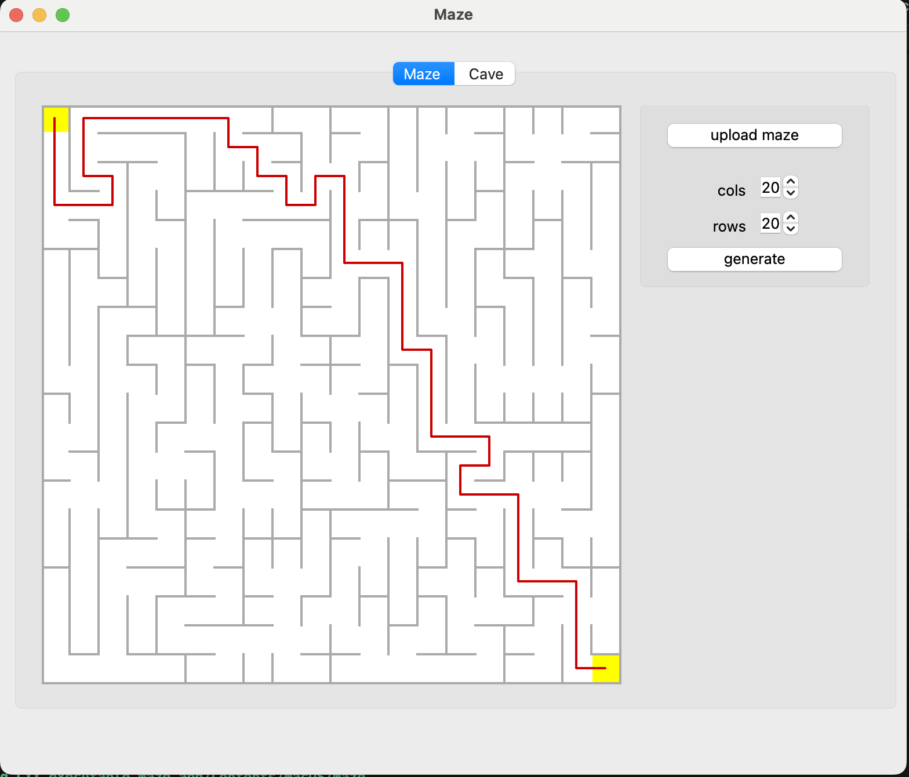
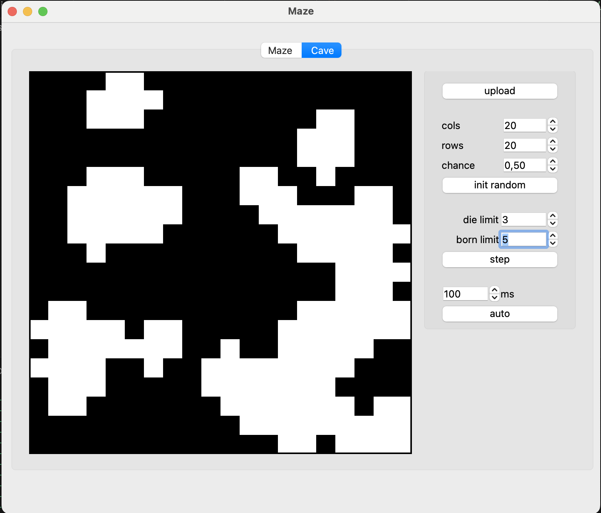
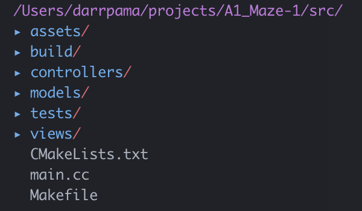

`Maze` это приложение для визуализации лабиринтов и пещер, представленных в текстовом формате, а также поиска пути в лабиринте.

## Установка
Для установки в директорию `src` перейдите в папку `src` и вызовите команду `make install`.
```bash
cd src
make install
```

В папке `src` появится папка `build` приложение `3DViewer_2_0.app`

Для установки без запуска перейдите в папку `src` и вызовите команду `make build`.
```bash
make build
```

Для запуска тестов в папке `src` вызовите команду `make tests`.
```bash
make tests
```

Для удаления программы в папке `src` вызовите команду `make uninstall` или `make clean`.
```bash
make uninstall
```

Для корректной сборки на компьютере должен быть установлен пакет библиотек `Qt`, библиотека `googletest` и утилита `cmake`.

## Запуск
Приложение по-умолчанию запустится после команды `make install` Для повторного запуска приложения, из директории, в которую установили программу, вызовите команду `./Maze.app/Contents/MacOS/Maze`

После запуска тестов можно удалить временные файлы, в том числе папку с билдом, командой `make clean`
```bash
make clean
```

## Интерфейс




Приложение состоит из одного окна с двумя вкладками. В левой части вкладок расположен виджет для просмотра лабиринта и пещеры, в правой части находятся кнопки для загрузки файлов, генерации новых структур и  правила, по которым они создаются.

## Структура проекта
Проект реализован с использованием паттерна проектирования `MVC` и `Singleton` в контроллере.

Все исходные файлы проекта находятся в папке `src`. Её содержимое:


* `assets` - тестовые объекты и скриншоты данного README;
* `controllers` - реализация контроллера, связывающего модель и графический интерфейс;
* `models` - реализация парсинга `.txt` файлов с пещерами и лабиринтами, решение лабиринтов;
* `tests` - тесты для наших функций;
* `views` - файлы с графическим интерфейсом;
* `CMakeLists.txt`- файл для генерации дополнительного Makefile, который осуществляет сборку всего приложения;
* `main.cc`- файл, содержащий функцию `main()` и создающий все сущности, которые используются в приложении в дальнейшем;
* `Makefile` - главный мейкфайл всего проекта, позволяет запускать цели `all, install, uninstall, clean, dvi, dist, tests`.

## Лицензия

[MIT](https://choosealicense.com/licenses/mit/)